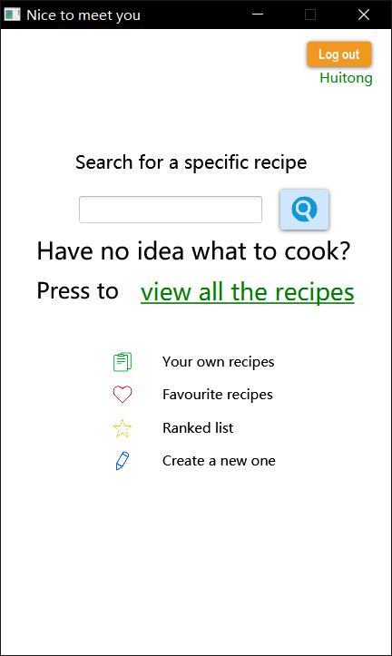
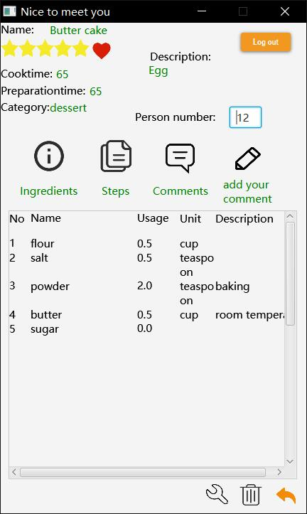
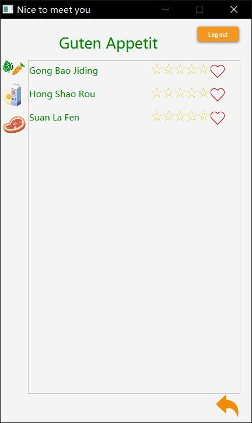

# digitalcookbook
This is the code of Software Engineering project digital cookbook.
## function
The digital cookbook contains search function. Users can use key words to search a recipe.

 
The cookbook offers function for edition.  The recipe can be added or selected and deleted when the recipe interface is open.

  
 
The digital cookbook offers ranking and commenting function. User can use this function to write the comments for the recipes or rank the recipes in the recipe interface. 
 
The digital cookbook also offers the exhibition function to give overview about all recipes.

## Tools
* [JavaSE 10](http://www.oracle.com/technetwork/java/javase/downloads/jdk10-downloads-4416644.html)
 
* [MySQL 8.0.11](https://dev.mysql.com/downloads/installer/)
 
* [JavaFX Scene Builder 2.0](http://www.oracle.com/technetwork/java/javase/downloads/sb2download-2177776.html)
 
* [Eclipse Oxygen](http://www.eclipse.org/oxygen/)
 
* [mysql-connector-java-8.0.11](https://dev.mysql.com/downloads/connector/j/)

## developer
* Huitong Lu
* Jixiang Yao
* Xiyuan wang
* Yining He

